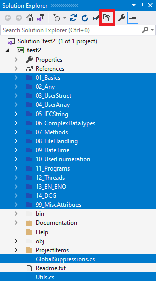

# PLCnext Technology - C# Examples

[PLCnext Technology](https://phoenixcontact.com/plcnext) integrates programming of different languages, and enables users to create real time components in C# using their familiar Microsoft&reg; Visual Studio&reg; as the integrated development environment.
For More information please visit our [Community](https://www.plcnext-community.net).

The [`CSharpExamples`](https://github.com/PLCnext/CSharpExamples) repository is a collection of various examples for PLCnext Technology controllers. It is assumed that the reader has basic knowledge about C# programming in general and has read the **User Manual** and the **PLCnext Technology Quick Start Guide**. Each example explains one or more topics. Specific explanations can be found in the `ExampleName.md` file located next to the `ExampleName.cs`

## Table of Content

|\#| Topic | Content
| ----- | ------ | ------
|[01](PLCnext_CSharpExamples/01_Basics/)| [Basics](PLCnext_CSharpExamples/01_Basics/Basics.md) | Implements a basic counter. ([Basics.cs](PLCnext_CSharpExamples/01_Basics/Basics.cs))
|[02](PLCnext_CSharpExamples/02_Any/)| [ANY](PLCnext_CSharpExamples/02_Any/Any.md) | Function and function block with "ANY" parameter. ([FunWithANY_BIT.cs](PLCnext_CSharpExamples/02_Any/FunWithANY_BIT.cs), [FunWithANY_NUM.cs](PLCnext_CSharpExamples/02_Any/FunWithANY_NUM.cs), [FB1WithANY_BIT.cs](PLCnext_CSharpExamples/02_Any/FB1WithANY_BIT.cs), [FB1WithANY_NUM.cs](PLCnext_CSharpExamples/02_Any/FB1WithANY_NUM.cs), [FB2WithANY_BIT.cs](PLCnext_CSharpExamples/02_Any/FB2WithANY_BIT.cs), [FB2WithANY_NUM.cs](PLCnext_CSharpExamples/02_Any/FB2WithANY_NUM.cs))
|[03](PLCnext_CSharpExamples/03_UserStruct/)| [User Struct](PLCnext_CSharpExamples/03_UserStruct/UserStruct.md) | Function block with a user struct. ([FBWithUserStruct.cs](PLCnext_CSharpExamples/03_UserStruct/FBWithUserStruct.cs))
|[04](PLCnext_CSharpExamples/04_UserArray/)| [User Array](PLCnext_CSharpExamples/04_UserArray/UserArray.md) | Function block with a user array. ([FBWithUserArray.cs](PLCnext_CSharpExamples/04_UserArray/FBWithUserArray.cs))
|[05](PLCnext_CSharpExamples/05_IECString/)| [IEC String](PLCnext_CSharpExamples/05_IECString/IECString.md) | Use type IecStringEx for strings in PLCnext Engineer. ([FBWithString.cs](PLCnext_CSharpExamples/05_IECString/FBWithString.cs))
|[05.1](PLCnext_CSharpExamples/05_IECString/)| [IEC WString](PLCnext_CSharpExamples/05_IECString/IECWString.md) | Use type IecWString for wide character strings in PLCnext Engineer. ([FBWithWString.cs](PLCnext_CSharpExamples/05_IECString/FBWithWString.cs))
|[06](PLCnext_CSharpExamples/06_ComplexDataTypes/)| [Complex Data Types](PLCnext_CSharpExamples/06_ComplexDataTypes/ComplexDataTypes.md) | Complex data type as function's return value. ([FUWithComplexDataType.cs](PLCnext_CSharpExamples/06_ComplexDataTypes/FUWithComplexDataType.cs))
|[07](PLCnext_CSharpExamples/07_Methods/)| [Methods](PLCnext_CSharpExamples/07_Methods/Methods.md) | An example for providing Methods written in C# that can be used in IEC language. ([FBWithMethods.cs](PLCnext_CSharpExamples/07_Methods/FBWithMethods.cs))
|[08](PLCnext_CSharpExamples/08_FileHandling)| [File Handling](PLCnext_CSharpExamples/08_FileHandling/FileHandling.md) | Use "File" in namespace System.IO ([WriteFile.cs](PLCnext_CSharpExamples/08_FileHandling/WriteFile.cs), [ReadFile.cs](PLCnext_CSharpExamples/08_FileHandling/ReadFile.cs))
|[09](PLCnext_CSharpExamples/09_DateTime/)| [DateTime](PLCnext_CSharpExamples/09_DateTime/DateTime.md) | Getting UTC ticks and conversion into a string. ([FBWithDateTime.cs](PLCnext_CSharpExamples/09_DateTime/FBWithDateTime.cs))
|[10](PLCnext_CSharpExamples/10_UserEnumeration/)| [User Enumeration](PLCnext_CSharpExamples/10_UserEnumeration/UserEnumeration.md) | Shows how to add and use user enumeration. ([UserEnumeration.cs](PLCnext_CSharpExamples/10_UserEnumeration/UserEnumeration.cs))
|[11](PLCnext_CSharpExamples/11_Programs/)| [Programs](PLCnext_CSharpExamples/11_Programs/Programs.md) | Provides a template for programs in C#. ([Program.cs](PLCnext_CSharpExamples/11_Programs/Program.cs))
|[12](PLCnext_CSharpExamples/12_Threads/)| [Threads](PLCnext_CSharpExamples/12_Threads/Threads.md) | Functionblock to start a thread. ([Threads.cs](PLCnext_CSharpExamples/12_Threads/Threads.cs))
|[12.1](PLCnext_CSharpExamples/12_Threads/)| [Background Threads](PLCnext_CSharpExamples/12_Threads/BackgroundThread.md) | Functionblock to start a thread. ([BackgroundThread.cs](PLCnext_CSharpExamples/12_Threads/BackgroundThread.cs))
|[13](PLCnext_CSharpExamples/13_EN_ENO/)| [EN\/ENO](PLCnext_CSharpExamples/13_EN_ENO/EN_ENO.md) | Using EN\/ENO in PLCnext C# FU/FBs. ([FU_ENENO.cs](PLCnext_CSharpExamples/13_EN_ENO/FU_ENENO.cs), [FB_ENENO.cs](PLCnext_CSharpExamples/13_EN_ENO/FB_ENENO.cs))
|[14](PLCnext_CSharpExamples/14_DCG/)| [Dowload Change](PLCnext_CSharpExamples/14_DCG/DCG.md) | Make your C\# code Download Change capable. ([DCG_example1.cs](PLCnext_CSharpExamples/14_DCG/DCG_example1.cs), [DCG_example2.cs](PLCnext_CSharpExamples/14_DCG/DCG_example2.cs), [DCG_example3.cs](PLCnext_CSharpExamples/14_DCG/DCG_example3.cs))
|[99](PLCnext_CSharpExamples/99_MiscAttribues/)| [MiscAttributes](PLCnext_CSharpExamples/99_MiscAttribues/MiscAttributes.md) | Making data visible in OPC UA and when to use explicit IEC data type definition. ([MiscAttributes](PLCnext_CSharpExamples/99_MiscAttribues/MiscAttributes.cs))

## Getting Started

Find all information how to start coding C# for PLCnext Technology in our [Community](https://www.plcnext-community.net/index.php?option=com_content&view=category&layout=blog&id=74&Itemid=350&lang=en) or watch the [Youtube Playlist](https://www.youtube.com/playlist?list=PLXpIBdAgtoRKO3lWQAQweje1oC7JwJcnM) on our [Technical Support Channel](https://www.youtube.com/c/PhoenixContactTechnicalSupport)

## Creating C# Example Project

Most of the examples in the `PLCnext_CSharpExamples` folder are ready to build and try with the PLCnext Toolchain C# Extension for Visual Studio. Follow the steps to get started:

1. Make sure you have all the [required installations](https://www.plcnext.help/te/Programming/Cpp/Cpp_programming/Required_Installations_2021_6.htm?tocid=13_4_3_2).
2. Start a new [Visual Studio project](https://www.plcnext.help/te/Programming/Csharp/Csharp_programming/Creating_a_Csharp_firmware_library.htm) (only step 1 is needed).
3. Copy all files from the `PLCnext_CSharpExamples` folder to your project folder.
4. In Visual Studio Solution Explorer enable "Show All Files" (see red square in the picture)

1. Select all added files and add them to the project via right click "Include in Project".
2. To be able to build, enable unsafe code in the Project --> Properties --> Build and select "Allow unsafe code"

> **Note:** There will be some Warnings and Massages from the Code Analyzer which can be ignored or will be suppressed via the `GlobalSuppressions.cs` file.

## Contributing

You can participate in this project by [submitting bugs and feature requests](https://github.com/PLCnext/CSharpExamples/issues).
Furthermore you can help us by discussing issues and let us know where you have problems or where others could struggle.

## Feedback

You can give feedback to this project in different ways:

* Ask a question in our [Forum](https://www.plcnext-community.net/index.php?option=com_easydiscuss&view=categories&Itemid=221&lang=en).
* Request a new feature on [GitHub](CONTRIBUTING.md).
* Vote for [Popular Feature Requests](https://github.com/PLCnext/CSharpExamples/issues?q=is%3Aopen+is%3Aissue+label%3Afeature-request+sort%3Areactions-%2B1-desc).
* File a bug in [GitHub Issues](https://github.com/PLCnext/CSharpExamples/issues).

## License

Copyright (c) Phoenix Contact Gmbh & Co KG. All rights reserved.

Licensed under the [MIT](LICENSE) License.
